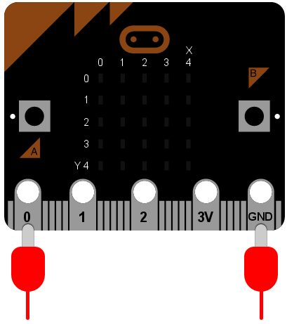

# Dźwięki i muzyka

## Czego się nauczysz w tym rozdziale?

* Jak zmusić micro:bit to odgrywania melodii
* Jak stworzyć własną melodię

Jeśli tylko podłączysz do niego głośnik, microbit jest zdolny wydawania różnych dźwięków, w tym i muzyki. Spróbuj

## W jaki sposób podłączyć głośnik?

O tak jak na rysunku:


Możliwe że korzystasz adaptera do płytek stykowych. W tym wypadku podłącz głośnik do pinów oznaczonych jak "gnd" oraz "1" (w dowolnej kolejności).

## Zagraj mi coś

Nasz micro:bit jest muzykalny - w standardzie, moduł `music` zawiera następujące melodyjki i dźwięki:
```
DADADADUM
ENTERTAINER
PRELUDE
ODE
NYAN
RINGTONE
FUNK
BLUES
BIRTHDAY
WEDDING
FUNERAL
PUNCHLINE
PYTHON
BADDY
CHASE
BA_DING
WAWAWAWAA
JUMP_UP
JUMP_DOWN
POWER_UP
POWER_DOWN
```

Aby sprawdzić któryś z dźwięków wystarczy odpalić:
```
import music
music.play(music.NYAN)
```
I vilola!

Wybierz swoją ulubioną nutę i zapamiętaj jej nazwę.

## Własne melodie

Osoby bardziej uzdolnione muzycznie mogą zapragnąć stworzyć własną melodię. Aby to zrobić, musimy przekazać mu nutki w formie listy, np.

```
import music

tune = ["C4:4", "D4:4", "E4:4", "C4:4", "C4:4", "D4:4", "E4:4", "C4:4",
        "E4:4", "F4:4", "G4:8", "E4:4", "F4:4", "G4:8"]
music.play(tune)
```

Przyjęta notacja to "<nuta><oktawa>:<czas trwawnia>".

Odpal i przetestuj wynik. Co to za muzyka?

## Surowe dźwięki

Na wstępie apeluję - nie nadużywaj tej funkcjonalności! BŁAGAM!

Możesz też zarządać aby micro:bit wydał dźwięk o dowolnej częstotliwości. Możesz to użyć zrobienia własnych ciekawych efektów (może wykorzystując akcelerometr i/lub kompas zrobisz muzyczny instrument?).

Aby wydać jakiś dźwięk, należy wydać polecenie `music.pitch(<częstotliwość>, <czas trwania>)`, gdzie częstotliwość to... no wiesz, zaś czas trwania wyrażany jest w milisekundach - ustaw 1000 żeby dźwięk trwał przez jedną sekundę.

Przykład:
```
import music

while True:
    for freq in range(880, 1760, 16):
        music.pitch(freq, 6)
    for freq in range(1760, 880, -16):
        music.pitch(freq, 6)
```

